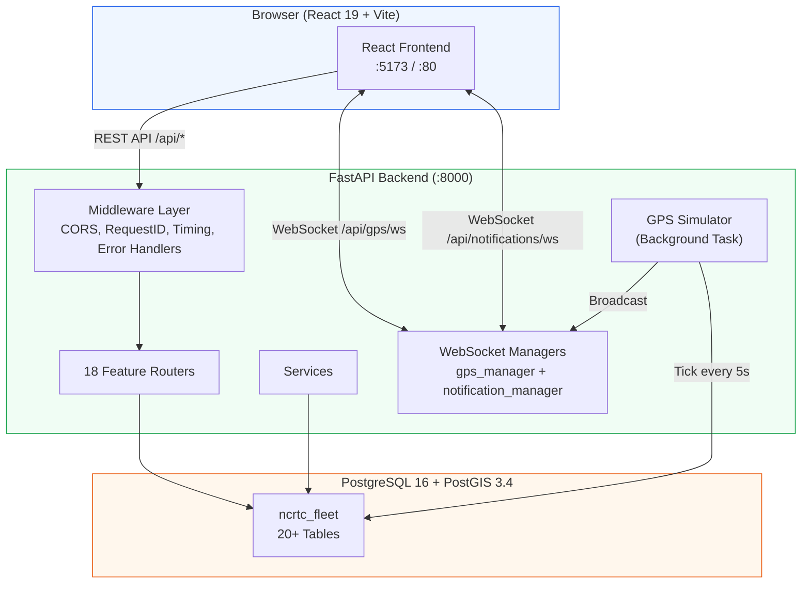
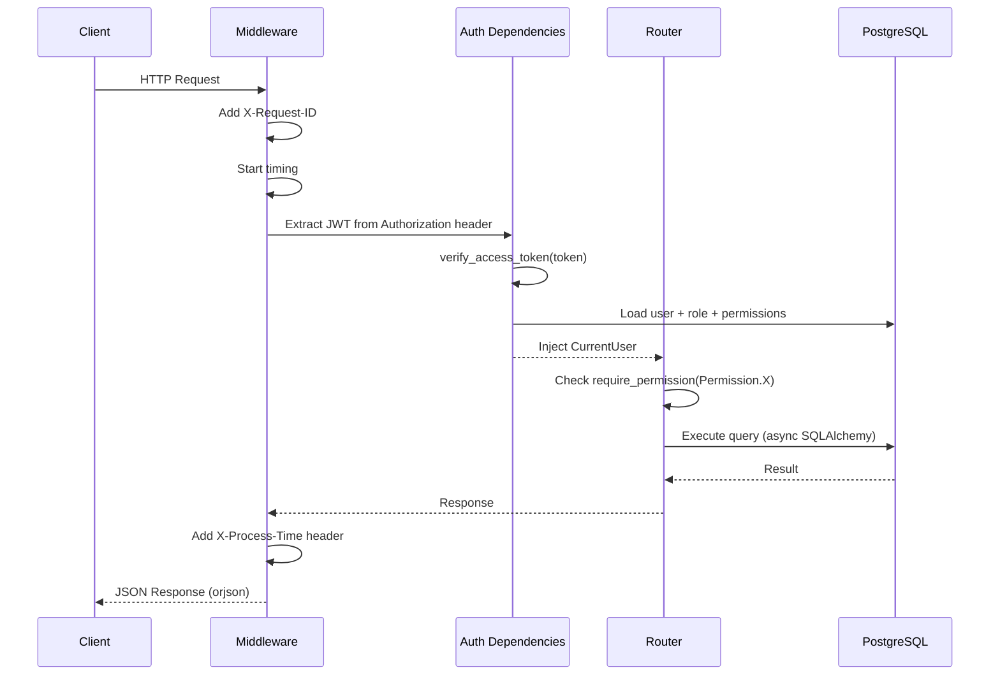
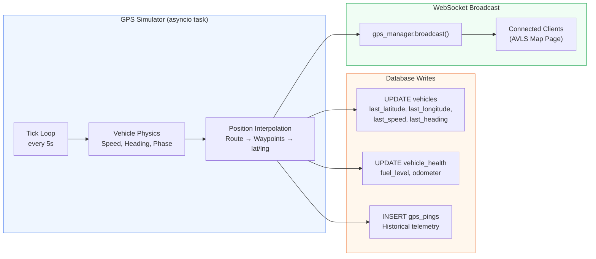
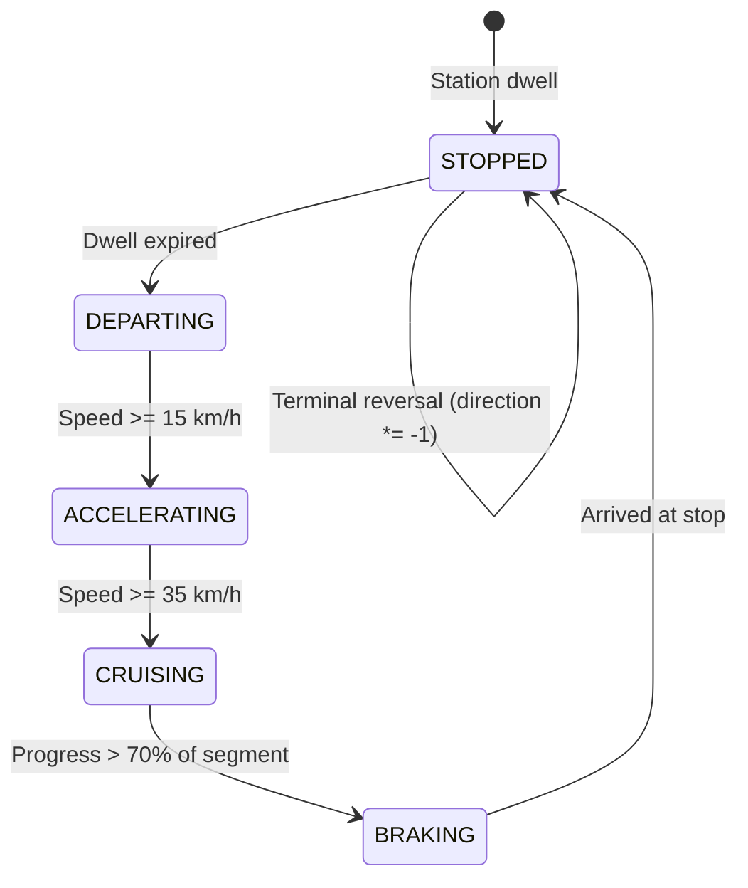
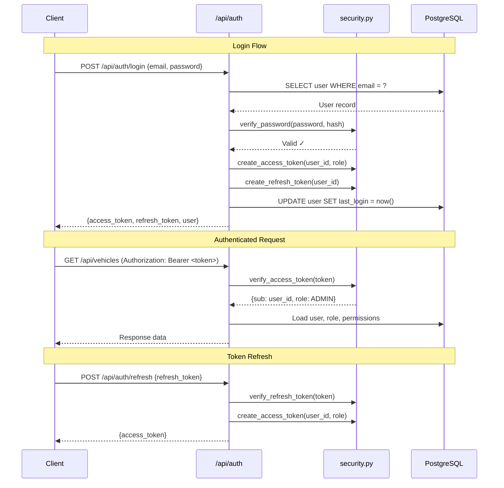
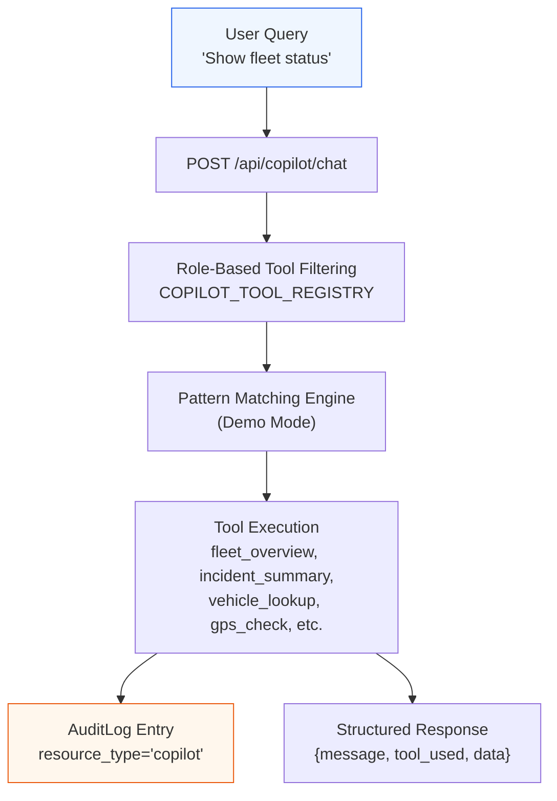
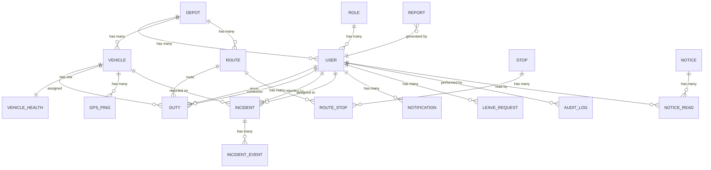
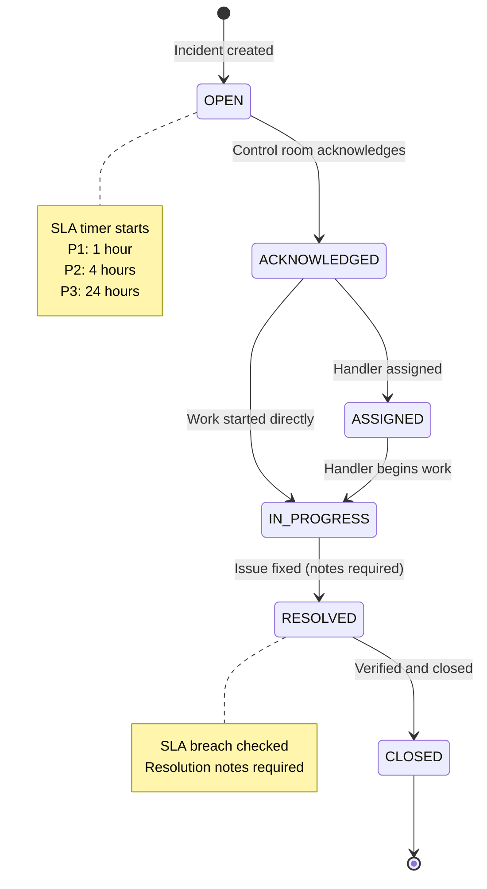
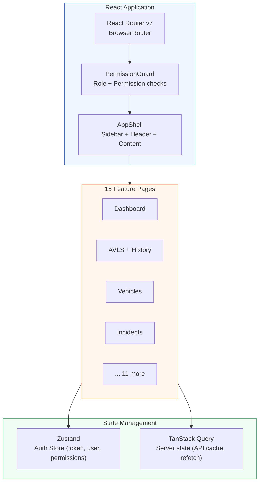

# Architecture — NCRTC Fleet Management Platform

System architecture documentation with diagrams. All information verified against the current implementation.

---

## 1. System Architecture

---

## 2. Request Lifecycle

### Middleware Stack (applied in order)

| Middleware | Purpose |
|-----------|---------|
| `CORSMiddleware` | Cross-origin resource sharing for frontend |
| `RequestIDMiddleware` | Generates `X-Request-ID` UUID for each request |
| `TimingMiddleware` | Adds `X-Process-Time` header (ms) |
| `AppException` handler | Catches custom exceptions → structured JSON errors |
| `ValidationError` handler | Catches Pydantic validation errors → 422 with field details |

---

## 3. GPS Data Flow

### Vehicle Movement Phases

### Deadlock Prevention

The simulator uses three strategies to avoid PostgreSQL deadlocks:
1. **Deterministic lock ordering** — Vehicle states sorted by `vehicle_id` before DB writes
2. **Single transaction** — All updates in one `BEGIN` block to minimize lock duration
3. **Retry with backoff** — Up to 3 retries with exponential delay (0.2s, 0.4s, 0.8s)

---

## 4. Authentication Flow

### Token Configuration

| Setting | Default | Description |
|---------|---------|-------------|
| `JWT_ALGORITHM` | `HS256` | Signing algorithm |
| `JWT_ACCESS_TOKEN_EXPIRE_MINUTES` | `30` | Access token lifetime |
| `JWT_REFRESH_TOKEN_EXPIRE_DAYS` | `7` | Refresh token lifetime |
| `SECRET_KEY` | *(must change in prod)* | Shared signing secret |

---

## 5. AI Copilot Architecture

### Copilot Modes

| Mode | Config | Behavior |
|------|--------|----------|
| `demo` (default) | `COPILOT_MODE=demo` | Pattern-matching against query text, executes local DB tools |
| `live` | `COPILOT_MODE=live` + `GEMINI_API_KEY` | External LLM integration (not yet implemented) |

### Tool Registry (role-filtered)

Tools are registered in `COPILOT_TOOL_REGISTRY` and filtered by the user's role at query time. Each query is logged to the `audit_logs` table.

---

## 6. Database Entity Relationship

### Key Design Patterns

- **Soft deletes:** All entities use `is_deleted` boolean flag (inherited from `BaseModel`)
- **Audit fields:** `created_by`, `updated_by`, `created_at`, `updated_at` on all entities
- **UUID primary keys:** All tables use `uuid.uuid4()` as default
- **Enum constraints:** 13 PostgreSQL-backed enums for type safety

---

## 7. Incident State Machine

### Incident Severity Levels

| Severity | SLA Deadline | Examples |
|----------|-------------|---------|
| **P1** (Critical) | 1 hour | Brake failure, track obstruction, SPAD |
| **P2** (High) | 4 hours | Pantograph damage, door malfunction, route deviation |
| **P3** (Low) | 24 hours | AC failure, CCTV malfunction, graffiti |

### Valid State Transitions

| Current State | Allowed Next States |
|--------------|-------------------|
| `OPEN` | `ACKNOWLEDGED` |
| `ACKNOWLEDGED` | `ASSIGNED`, `IN_PROGRESS` |
| `ASSIGNED` | `IN_PROGRESS` |
| `IN_PROGRESS` | `RESOLVED` |
| `RESOLVED` | `CLOSED` |
| `CLOSED` | *(none)* |

---

## 8. Frontend Architecture

### Frontend Route → Permission Mapping

| Route | Permission Required | Role Restriction |
|-------|-------------------|-----------------|
| `/dashboard` | *(any authenticated)* | — |
| `/avls`, `/avls/history` | `gps.view` | — |
| `/vehicles` | `vehicle.view` | — |
| `/routes` | `route.view` | — |
| `/duties`, `/roster` | `duty.view` | — |
| `/incidents` | `incident.view` | — |
| `/notices` | `notice.view` | — |
| `/analytics` | `analytics.view` | — |
| `/users` | `user.view` | — |
| `/copilot` | `copilot.use` | — |
| `/reports` | `report.view` | — |
| `/audit` | `audit.view` | — |
| `/leaves` | *(any authenticated)* | — |
| `/system-health` | — | `ADMIN` only |
