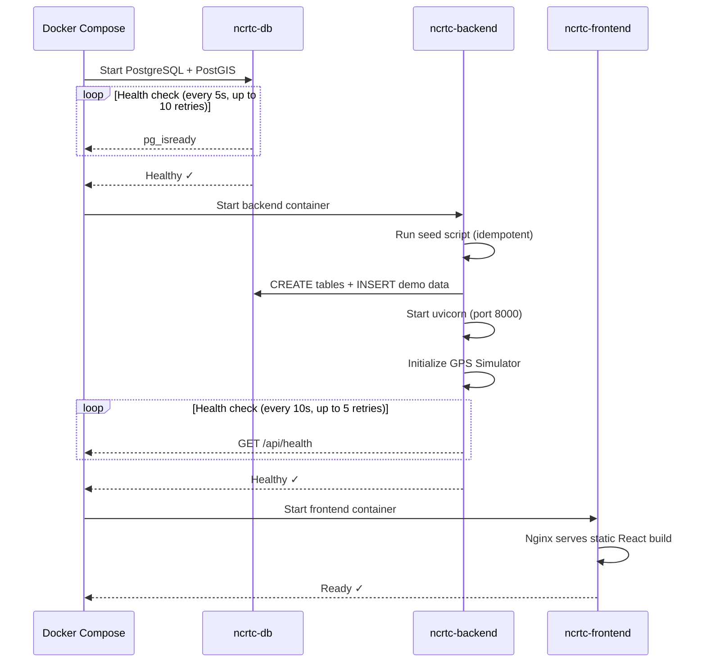

# Docker Operations — NCRTC Fleet Management Platform

Container orchestration guide. All information verified against [`docker-compose.yml`](docker-compose.yml), [`backend/Dockerfile`](backend/Dockerfile), and [`frontend/Dockerfile`](frontend/Dockerfile).

---

## Service Topology

```
┌─────────────────────────────────────────────────────────────┐
│  Docker Compose Network                                     │
│                                                             │
│  ┌──────────────┐    ┌──────────────┐    ┌──────────────┐  │
│  │  ncrtc-db    │    │ncrtc-backend │    │ncrtc-frontend│  │
│  │  :5432       │◄───│  :8000       │◄───│  :80         │  │
│  │  PostGIS     │    │  FastAPI     │    │  Nginx       │  │
│  └──────────────┘    └──────────────┘    └──────────────┘  │
│        ▲                    │                    │          │
│        │                    │                    │          │
│  pgdata volume        uploads volume        static build   │
└─────────────────────────────────────────────────────────────┘

Exposed ports:
  • 5432  →  PostgreSQL (direct DB access)
  • 8000  →  FastAPI API + Swagger UI
  • 80    →  React frontend (Nginx)
```

---

## Services

### 1. Database (`ncrtc-db`)

| Property | Value |
|----------|-------|
| **Image** | `postgis/postgis:16-3.4` |
| **Container name** | `ncrtc-db` |
| **Port** | `5432:5432` |
| **Volume** | `pgdata:/var/lib/postgresql/data` (persistent) |
| **Restart policy** | `unless-stopped` |

**Environment variables:**

| Variable | Value |
|----------|-------|
| `POSTGRES_DB` | `ncrtc_fleet` |
| `POSTGRES_USER` | `ncrtc_admin` |
| `POSTGRES_PASSWORD` | `ncrtc_secure_password_2024` |

**Health check:**
```bash
pg_isready -U ncrtc_admin -d ncrtc_fleet
# Interval: 5s, Timeout: 5s, Retries: 10
```

---

### 2. Backend (`ncrtc-backend`)

| Property | Value |
|----------|-------|
| **Build context** | `./backend` |
| **Dockerfile** | `backend/Dockerfile` |
| **Base image** | `python:3.12-slim` |
| **Container name** | `ncrtc-backend` |
| **Port** | `8000:8000` |
| **Volume** | `./uploads:/app/uploads` (host-mounted) |
| **Depends on** | `db` (healthy) |
| **Restart policy** | `unless-stopped` |

**Build stages:**
1. Install system deps (`build-essential`, `libpq-dev`, `curl`)
2. `pip install -r requirements.txt`
3. Copy application code
4. Create upload directories (`uploads/incidents`, `uploads/notices`, `uploads/profiles`, `uploads/reports`)

**Startup command:**
```bash
# 1. Run seed script (idempotent — skips if already seeded)
python -c 'from app.seed import seed_database; import asyncio; asyncio.run(seed_database())'

# 2. Start uvicorn
uvicorn app.main:app --host 0.0.0.0 --port 8000
```

**Environment variables passed:**

| Variable | Value | Description |
|----------|-------|-------------|
| `POSTGRES_HOST` | `db` | Docker service name |
| `POSTGRES_PORT` | `5432` | |
| `POSTGRES_DB` | `ncrtc_fleet` | |
| `POSTGRES_USER` | `ncrtc_admin` | |
| `POSTGRES_PASSWORD` | `ncrtc_secure_password_2024` | |
| `APP_ENV` | `production` | |
| `APP_DEBUG` | `false` | |
| `SECRET_KEY` | `${SECRET_KEY:-ncrtc-prod-secret-key-change-in-production}` | Override via host env |
| `CORS_ORIGINS` | `["http://localhost","http://localhost:80","http://localhost:5173","http://localhost:3000"]` | |
| `GPS_SIMULATOR_ENABLED` | `true` | |
| `DEMO_MODE` | `${DEMO_MODE:-false}` | Override via host env |

**Health check:**
```bash
curl -f http://localhost:8000/api/health
# Interval: 10s, Timeout: 5s, Retries: 5
```

---

### 3. Frontend (`ncrtc-frontend`)

| Property | Value |
|----------|-------|
| **Build context** | `./frontend` |
| **Dockerfile** | `frontend/Dockerfile` |
| **Container name** | `ncrtc-frontend` |
| **Port** | `80:80` |
| **Depends on** | `backend` (healthy) |
| **Restart policy** | `unless-stopped` |

**Multi-stage build:**

| Stage | Base Image | Purpose |
|-------|-----------|---------|
| `builder` | `node:20-alpine` | `npm ci` + `npm run build` |
| Production | `nginx:alpine` | Serve static files from `/usr/share/nginx/html` |

The Nginx configuration (`nginx.conf`) is copied into the container to handle SPA routing and API proxying.

---

## Startup Sequence



---

## Common Operations

### Start all services
```bash
docker compose up --build -d
```

### View logs
```bash
# All services
docker compose logs -f

# Single service
docker compose logs -f backend
docker compose logs -f db
docker compose logs -f frontend
```

### Stop all services
```bash
docker compose down
```

### Stop and remove volumes (full reset)
```bash
docker compose down -v
```
> ⚠️ This deletes all database data. The seed script will re-run on next startup.

### Rebuild a single service
```bash
docker compose build backend
docker compose up -d backend
```

### Access database directly
```bash
docker exec -it ncrtc-db psql -U ncrtc_admin -d ncrtc_fleet
```

### Run seed script manually
```bash
docker exec ncrtc-backend python -m app.seed
```

### Re-seed GPS data only
```bash
docker exec ncrtc-backend python -m app.seed --reseed-gps
```

### Access API docs
- **Swagger UI:** [http://localhost:8000/docs](http://localhost:8000/docs)
- **ReDoc:** [http://localhost:8000/redoc](http://localhost:8000/redoc)

---

## Volumes

| Volume | Type | Mount Point | Purpose |
|--------|------|------------|---------|
| `pgdata` | Named volume | `/var/lib/postgresql/data` | Persistent database storage |
| `./uploads` | Bind mount | `/app/uploads` | Uploaded files (incidents, notices, profiles, reports) |

---

## Network

All three services share the default Docker Compose bridge network. Service names (`db`, `backend`, `frontend`) are DNS-resolvable within the network.

| Connection | From | To | Protocol |
|-----------|------|-----|----------|
| API requests | `frontend` (Nginx proxy) | `backend:8000` | HTTP |
| DB queries | `backend` | `db:5432` | PostgreSQL (asyncpg) |
| WebSocket | Browser (client) | `backend:8000` | WS |

---

## Production Considerations

| Area | Recommendation |
|------|---------------|
| **SECRET_KEY** | Set a strong random value via environment: `SECRET_KEY=<random-64-char-string>` |
| **Database password** | Override `POSTGRES_PASSWORD` with a secure value |
| **CORS** | Restrict `CORS_ORIGINS` to your production domain |
| **SSL/TLS** | Add a reverse proxy (Traefik, Caddy) in front of Nginx for HTTPS |
| **GPS Simulator** | Disable in production with real vehicle telemetry: `GPS_SIMULATOR_ENABLED=false` |
| **Workers** | Increase `BACKEND_WORKERS` for multi-process uvicorn |
| **Database backups** | Schedule `pg_dump` against the `pgdata` volume |
| **Log aggregation** | Forward `docker compose logs` to a centralized logging system |
